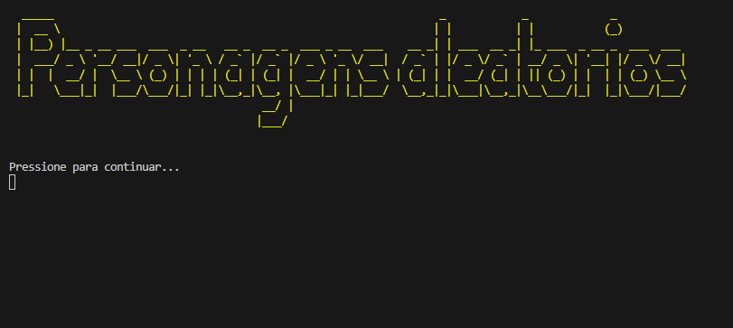
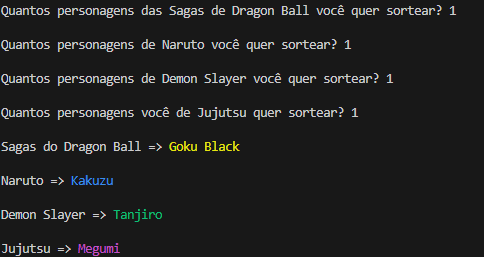

# ProjetoAnimes😎

Este programa tem a funcionalidade de sortear personagens aleatórios de animes, com a quantidade escolhida pelo usuário. O programa ainda está sendo modificado, porém já é possível testar sua primeira versão!

## Imagem do programa em funcionamento





## Teste o programa!

[download do programa😁](Programaparabaixar\ProjetoAnimes.zip)

### Comando para executar o programa
```
dotnet ProjetoAnimes.dll
```

---
## Agradecimentos

- [Ermoneges Palacio](https://github.com/ermogenes#ermogenes-palacio-)
- [Diego Neri](https://github.com/diegoneri)